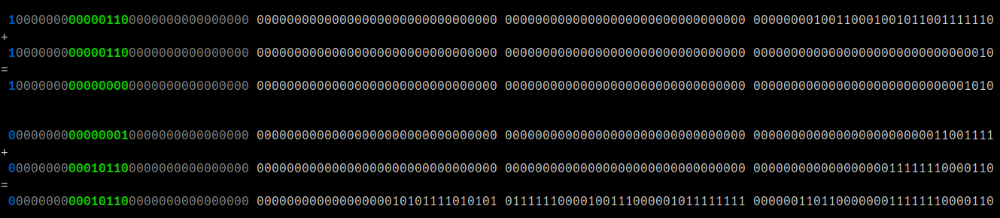

# decimal 

This is my implementation of the decimal floating point type in the C programming language (which is not in the language standard). It is similar to C# or Python decimal.

## Abstract

The Decimal data type provides the largest number of significant digits for a number. It supports up to 29 significant digits and can represent values exceeding 7,9228 x 10^28. It is especially suitable for calculations such as financial ones, which require a large number of digits, but does not allow rounding errors.

### Arithmetic Operators

| Operator name | Operators  | Function                                                                           | 
| ------ | ------ |------------------------------------------------------------------------------------|
| Addition | + | int s21_add(s21_decimal value_1, s21_decimal value_2, s21_decimal *result)         |
| Subtraction | - | int s21_sub(s21_decimal value_1, s21_decimal value_2, s21_decimal *result) |
| Multiplication | * | int s21_mul(s21_decimal value_1, s21_decimal value_2, s21_decimal *result) | 
| Division | / | int s21_div(s21_decimal value_1, s21_decimal value_2, s21_decimal *result) |

The functions return the error code:
- 0 - OK
- 1 - the number is too large or equal to infinity
- 2 - the number is too small or equal to negative infinity
- 3 - division by 0

### Comparison Operators

| Operator name | Operators  | Function | 
| ------ | ------ | ------ |
| Less than | < | int s21_is_less(s21_decimal, s21_decimal) |
| Less than or equal to | <= | int s21_is_less_or_equal(s21_decimal, s21_decimal) | 
| Greater than | > |  int s21_is_greater(s21_decimal, s21_decimal) |
| Greater than or equal to | >= | int s21_is_greater_or_equal(s21_decimal, s21_decimal) | 
| Equal to | == |  int s21_is_equal(s21_decimal, s21_decimal) |
| Not equal to | != |  int s21_is_not_equal(s21_decimal, s21_decimal) |

Return value:
- 0 - FALSE
- 1 - TRUE

### Convertors and parsers

| Convertor/parser | Function | 
| ------ | ------ |
| From int  | int s21_from_int_to_decimal(int src, s21_decimal *dst) |
| From float  | int s21_from_float_to_decimal(float src, s21_decimal *dst) |
| To int  | int s21_from_decimal_to_int(s21_decimal src, int *dst) |
| To float  | int s21_from_decimal_to_float(s21_decimal src, float *dst) |

Return value - code error:
- 0 - OK
- 1 - convertation error

### Another functions

| Description | Function                                                         | 
| ------ |------------------------------------------------------------------|
| Rounds a specified Decimal number to the closest integer toward negative infinity. | int s21_floor(s21_decimal value, s21_decimal *result)            |	
| Rounds a decimal value to the nearest integer. | int s21_round(s21_decimal value, s21_decimal *result)    |
| Returns the integral digits of the specified Decimal; any fractional digits are discarded, including trailing zeroes. | int s21_truncate(s21_decimal value, s21_decimal *result) |
| Returns the result of multiplying the specified Decimal value by negative one. | int s21_negate(s21_decimal value, s21_decimal *result)   |

Return value - code error:
- 0 - OK
- 1 - calculation error

## More info

- This static library is developed in C language of C11 standard using gcc compiler
- Program code follows Google style
- There is full coverage of library functions code with unit-tests with the Check library
- The gcov_report Makefile target generates a gcov report in the form of an html page
